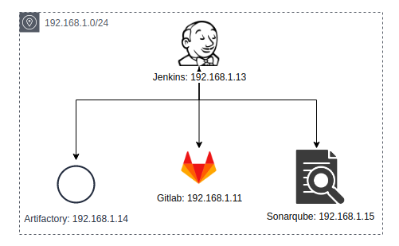

# MyCI
This is a guide about CI workflow

## Technical stack
* ### Jenkins
* ### Artifactory
* ### Sonarqube
* ### Gitlab

## Overview of networking architecture


## Problems
* [Set up Jenkins](doc/jenkins/setup_jenkins.md)
* [Plugins for Jenkins](doc/jenkins/plugins4jenkins.md)
---
* [Set up Artifcatory](doc/artifactory/setup_artifactory.md)
---
* [Set up Gitlab](doc/gitlab/setup_gitlab.md)
---
* [Set up Sonarqube](doc/sonarqube/setup_sonarqube.md)

## Utility in centos 7 context
#### Setup docker
```text
$ sudo yum install -y yum-utils

$ sudo yum-config-manager \
    --add-repo \
    https://download.docker.com/linux/centos/docker-ce.repo

$ sudo yum install -y docker-ce

$ docker version
```
### Setup docker compose
```text
$ sudo curl -L https://github.com/docker/compose/releases/download/1.21.2/docker-compose-`uname -s`-`uname -m` -o /usr/local/bin/docker-compose

$ sudo chmod +x /usr/local/bin/docker-compose

$ docker-compose version
```
### Setup UFW
```text
$ yum install -y epel-release
$ yum install  -y ufw

$ ufw enable
$ ufw default allow outgoing 
$ ufw default deny incoming 
$ ufw allow from 192.168.0/24 comment "local network"
```
### Command utility 
```text
$ yum install -y net-tools

$ netstat -antup
$ telnet 192.168.1.15 9000
$ ping 192.168.1.11
$ ps -axf
```

## Technical Support or Questions
If you have questions or need help integrating the product please "thanh29695@gmail.com" instead of opening an issue
