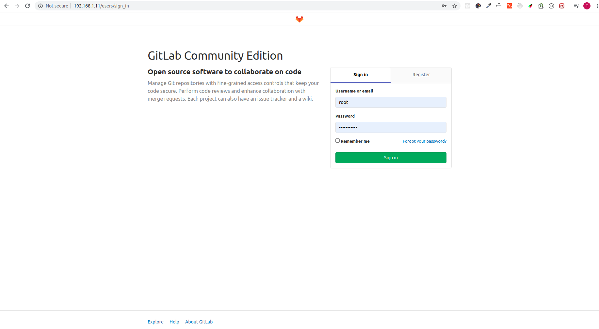

# Set up Gitlab
GitLab is a fully integrated software development platform.
It enables your team to be transparent, fast, effective, and cohesive from discussion on a new idea to production, all on the same platform.

### Using docker-compose
```yaml
web:
  image: 'gitlab/gitlab-ce:latest'
  container_name: 'gitlab'
  restart: always
  hostname: 'mygitlab'
  environment:
    GITLAB_OMNIBUS_CONFIG: |
      external_url 'http://mygitlab.xyz'
      registry_external_url 'http://mygitlab.xyz:5005'
      gitlab_rails['smtp_enable'] = true
      gitlab_rails['smtp_address'] = "smtp.gmail.com"
      gitlab_rails['smtp_port'] = 587
      gitlab_rails['smtp_user_name'] = "mygitlab@gmail.com"
      gitlab_rails['smtp_password'] = "password"
      gitlab_rails['smtp_domain'] = "smtp.gmail.com"
      gitlab_rails['smtp_authentication'] = "login"
      gitlab_rails['smtp_enable_starttls_auto'] = true
      gitlab_rails['smtp_tls'] = false
      gitlab_rails['smtp_openssl_verify_mode'] = 'peer'
      # Add any other gitlab.rb configuration here, each on its own line
  ports:
    - '5005:5005'
    - '8880:80'
    - '443:443'
    - '2020:22'
    - '587:587'
  volumes:
    - '/data/gitlab/config:/etc/gitlab'
    - '/data/gitlab/logs:/var/log/gitlab'
    - '/data/gitlab/data:/var/opt/gitlab'
```
### Quickly
```bash
$ docker-compose up -d
```
## Configuration
```text
$ docker exec -it gitlab vim /etc/gitlab/gitlab.rb
$ docker restart gitlab
```
## Logging
```text
$ docker logs -f --tail 20 gitlab
```
### Demo

