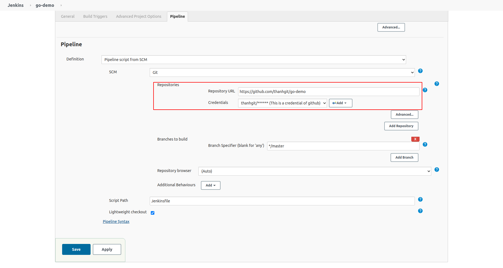
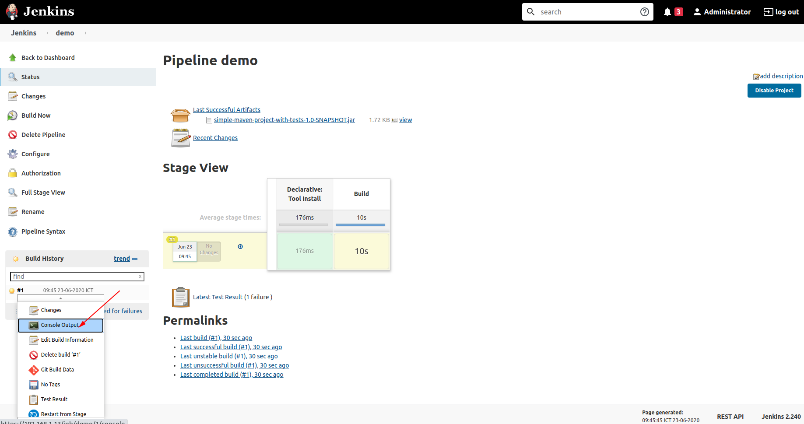

# Run go project
Demo run jenkins pipeline

## Create pipeline
* ### Step1: click New Item
* ### Step2: named for pipeline, then click Pipeline
* ### Step3: paste script following into pipeline section 

* ### Step4: click Save
* ### Step4: click Build Now 
* ### Step5: click #1 -> Console Output: to see result

## Jenkins file
```text
pipeline {
    agent any
    tools {
        go 'go-1.14'
    }
    environment {
        GO111MODULE = 'on'
	CGO_ENABLED = '0'
    }
    stages {
        stage('Compile') {
            steps {
                sh 'go build'
            }
        }
	stage('Test') {
	    steps {
		sh 'go test'
	    }
	}
    }
}

```

