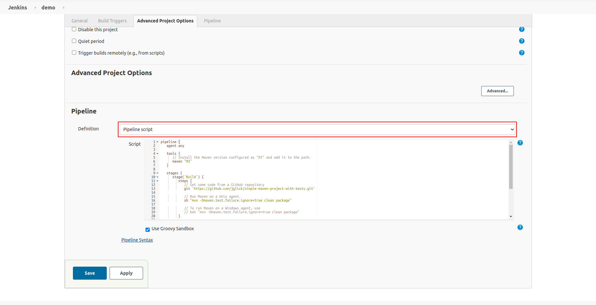

# Run maven project
Demo run jenkins pipeline

## Create pipeline
* ### Step1: click New Item
* ### Step2: named for pipeline, then click Pipeline
* ### Step3: paste script following into pipeline section 

* ### Step4: click Save
* ### Step4: click Build Now 
* ### Step5: click #1 -> Console Output: to see result

## Pipeline script
```text
pipeline {
   agent any

   tools {
      // Install the Maven version configured as "M3" and add it to the path.
      maven "M3"
   }

   stages {
      stage('Build') {
         steps {
            // Get some code from a GitHub repository
            git 'https://github.com/thanhgit/simple-maven-project-with-tests'

            // Run Maven on a Unix agent.
            sh "mvn -Dmaven.test.failure.ignore=true clean package"

            // To run Maven on a Windows agent, use
            // bat "mvn -Dmaven.test.failure.ignore=true clean package"
         }

         post {
            // If Maven was able to run the tests, even if some of the test
            // failed, record the test results and archive the jar file.
            success {
               junit '**/target/surefire-reports/TEST-*.xml'
               archiveArtifacts 'target/*.jar'
            }
         }
      }
   }
}
```

