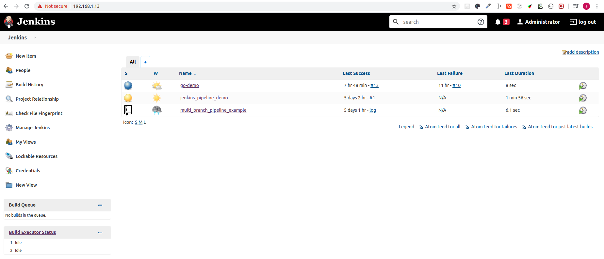

# Set up Jenkins
```text
Jenkins is a self-contained, open source automation server,
It can be used to automate all sorts of tasks related to building, testing, and delivering or deploying software.
```
### Using docker-compose
```yaml
version: '2'
services:
  jenkins:
    image: 'jenkins/jenkins'
    container_name: jenkins4dev
    restart: always
    ports:
      - '8080:8080'
      - '50000:50000'
    environment:
      JAVA_OPTS: "-Djava.awt.headless=true"
    volumes:
      - '/data/jenkins/data:/var/jenkins_home'
      - /var/run/docker.sock:/var/run/docker.sock
      - /usr/local/bin/docker:/usr/local/bin/docker

```

### Quickly
```bash
$ docker-compose up -d
```

### Demo
